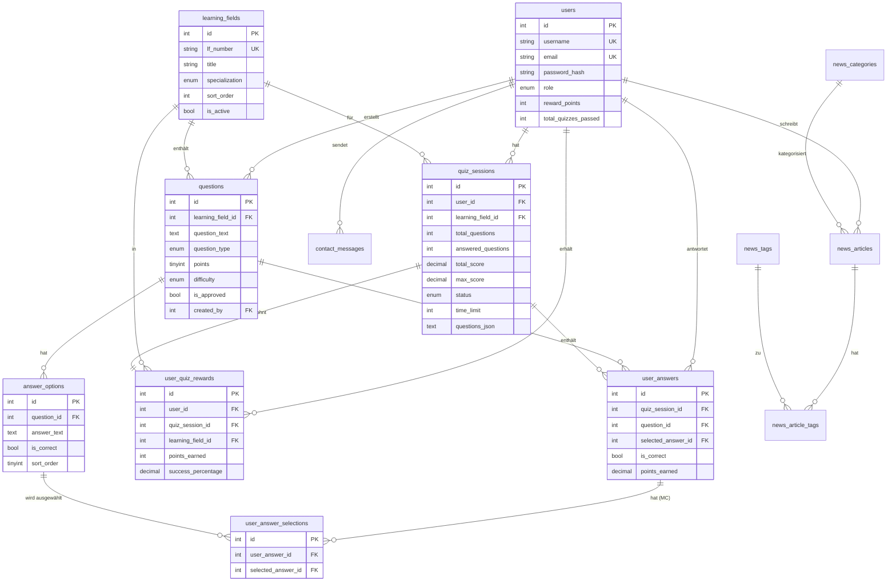

# Datenbank - Entity-Relationship-Diagramm (ERD)

**Basierend auf:** `dbs14381483.sql`  
**Letzte Aktualisierung:** 27. Januar 2025

---

## 📊 ERD (Mermaid)



---

## 🔗 Wichtige Beziehungen

### Quiz-System

```
users (1) ──< (N) quiz_sessions
quiz_sessions (1) ──< (N) user_answers
user_answers (1) ──< (N) user_answer_selections [nur Multiple-Choice]
questions (1) ──< (N) answer_options
questions (1) ──< (N) user_answers
learning_fields (1) ──< (N) questions
learning_fields (1) ──< (N) quiz_sessions
quiz_sessions (1) ──< (1) user_quiz_rewards
```

### News-System

```
users (1) ──< (N) news_articles
news_categories (1) ──< (N) news_articles
news_articles (N) ──< (N) news_tags [via news_article_tags]
```

---

## 📊 Kardinalitäten

| Beziehung | Kardinalität | Beschreibung |
|-----------|--------------|--------------|
| `users` → `quiz_sessions` | 1:N | Ein User kann mehrere Quiz-Sessions haben |
| `quiz_sessions` → `user_answers` | 1:N | Eine Session hat mehrere Antworten |
| `questions` → `answer_options` | 1:N | Eine Frage hat mehrere Antwortmöglichkeiten |
| `user_answers` → `user_answer_selections` | 1:N | Eine Antwort kann mehrere Auswahlen haben (MC) |
| `quiz_sessions` → `user_quiz_rewards` | 1:1 | Eine Session hat genau eine Belohnung |

---

## 🔗 Weitere Dokumentation

- **Tabellen-Übersicht:** [01_Tabellen-Uebersicht.md](01_Tabellen-Uebersicht.md)
- **Beziehungen:** [07_Beziehungen.md](07_Beziehungen.md)
- **Quiz-Tabellen:** [02_Quiz-Tabellen.md](02_Quiz-Tabellen.md)

---

**Ende der ERD-Dokumentation**

